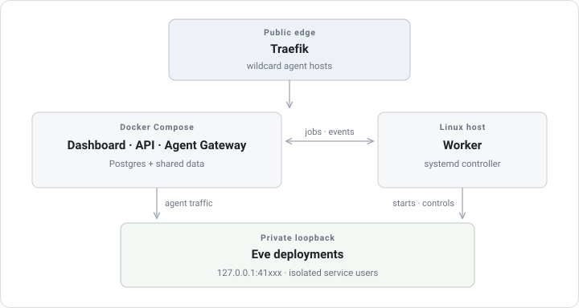

## Application ownership

| Component               | Responsibility                                                                                |
| ----------------------- | --------------------------------------------------------------------------------------------- |
| Dashboard               | Authenticated team console                                                                    |
| API                     | Platform contract, persistence, auth, import handling, and Built-in OTLP ingest               |
| Agent Gateway           | Public Agent data plane, trusted routing, affinity, streaming, and private Playground path    |
| Worker                  | Import, build, systemd runtime control, schedules, recovery, and cleanup                      |
| OpenTelemetry Collector | OTLP receive, domain filtering, retry queues, and destination fan-out                         |
| Workflow Dispatcher     | Durable timers, wake, and continuation dispatch; runs as its own systemd service or container |
| Postgres                | Platform state plus the single shared workflow database                                       |

## Dependency direction

```text
apps → packages
session-collector → core + db
db → core
core → no other Eveland package
apps -X→ apps
```

## Public request path

```text
Client
  → wildcard HTTPS Host
  → Traefik
  → Agent Gateway
  → route policy / SessionBinding
  → private loopback Deployment
  → Eve HTTP channel
```

## Observation path

Injected Eve hooks use Eveland-private OpenTelemetry providers without changing user instrumentation. API, Agent Gateway, Worker, and Agent signals enter the managed Collector over OTLP. Built-in is always enabled and projects Agent logs and Worker capacity metrics into Sessions, Usage, and Instance Health; it stores no raw spans, LogRecords, or Metric Points. When configured, Elastic receives all Eveland signals, while Langfuse receives Agent traces only. External destinations have isolated queues and empty-OTLP health probes. Capacity samples retain 30 days, derived Session and Usage data retain 90 days, and batch receipts retain 24 hours. Playground streaming is not the authoritative collection path.

## Deeper reference

- [Production architecture](/docs/production): supported core services, host Worker, and systemd topology
- [Design decisions overview](/docs/reference/design): full collection of architectural trade-offs behind structural choices
- [Why systemd, not Docker](/docs/reference/design/runtime): runtime selection and host density rationale
- [Agent Gateway invariants](/docs/reference/design/gateway): data-plane rules and security isolation boundaries
- [Observability architecture decisions](/docs/reference/design/observability): why OpenTelemetry is the sole telemetry transport
