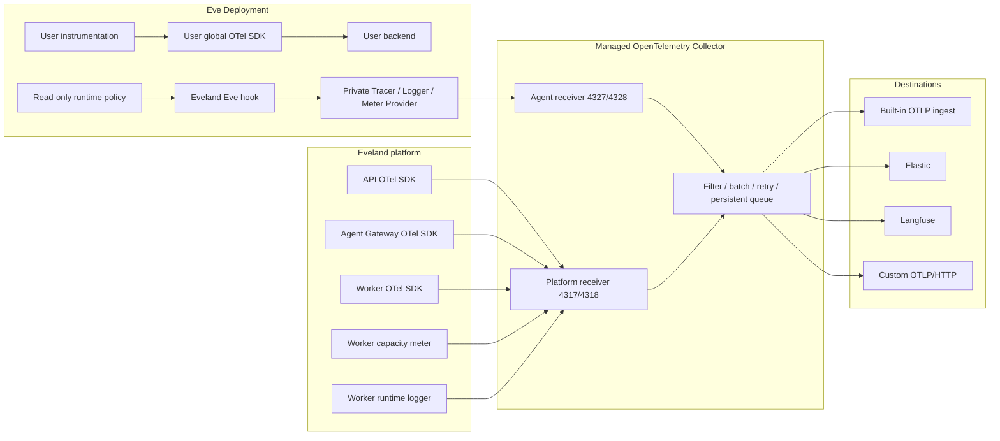

This page describes the observability architecture Eveland currently implements. Product
behavior is defined by the product specification (`spec.md` at the repository root);
deployment parameters are defined by [Production deployment](/docs/production) and
[Environment variables](/docs/reference/environment-variables).

## Product boundary

Eveland's own telemetry uses the OpenTelemetry API, semantic conventions, and OTLP
throughout. Eveland owns Eve domain semantics, the platform Resource, capture policy,
destination routing, and the Built-in read models; it defines no private telemetry
protocol.

Instrumentation in user source code belongs to the user:

- Eveland does not modify user instrumentation files, setup, samplers, or exporters.
- Eveland does not register or replace the user's global `TracerProvider`,
  `LoggerProvider`, `MeterProvider`, or `ContextManager`.
- Eveland does not override the user's generic `OTEL_*` environment variables.
- User providers keep sending to user-configured backends; Eveland does not read,
  merge, or forward that data.
- The switches in System settings control only the private providers Eveland injects.

Eveland's own telemetry is split into four stable domains:

| Domain     | Producer                                   | Content                                                   |
| ---------- | ------------------------------------------ | --------------------------------------------------------- |
| `agent`    | Private providers of the injected Eve hook | Session, Turn, Model, Tool, Subagent, provider usage      |
| `platform` | API, Agent Gateway, Worker, Collector      | HTTP, DB, job, component, and process signals             |
| `runtime`  | Worker private logger                      | Build, deploy, and runtime lifecycle logs                 |
| `capacity` | Worker private meter                       | CPU, memory, load, filesystem, inode, workload, heartbeat |

## Data flow



The managed Collector is the only fan-out component. Agents, API, Agent Gateway, and
Worker send only to the platform-managed receivers; they hold no external product
credentials and do not know which external destinations are enabled.

## Provider ownership

### Agent

Every Agent process can carry two provider sets that never take each other over:

```text
User global providers
Eveland private providers
```

`packages/agent-observer` injects the `@eveland/eve-runtime` instrumentation scope in
Eve's platform-reserved hook slot. The private providers obtain tracer, logger, and
meter directly from their instances, never call global registration, and never flush or
shut down user providers.

After dependency installation, the Extension integration also reads Eve v13's
`resolvedExtensions` and injects the same observer into every valid directory-form
Extension Subagent (including nested descendants and consumer overrides). At deploy
time the mounted `/run/eveland/observability/runtime.mjs` takes precedence; the
fallback runtime baked into the Extension is evaluated only when the platform mount is
absent, so two copies of model capture are never installed at once. Eve's file-form
Subagents have no independent hooks slot; whether local or Extension-sourced, they
remain recorded as an explicit coverage gap — Eveland does not patch Eve compiled
internals — and the complete Extension gaps `{kind,path,reason}` are written to
`.eveland/observability/extension-coverage-gaps.json`.

The private providers produce traces, logs, and metrics separately. The three signals
share the Resource and correlation identifiers but are managed by three independent
providers.

### Platform components

API, Agent Gateway, and Worker are processes Eveland fully owns; they start a standard
NodeSDK via `packages/platform-observability`. Worker additionally uses a private
LoggerProvider and MeterProvider to mark the `runtime` and `capacity` domains, keeping
distinct signal sources from collapsing into one Resource.

API and Agent Gateway are pure-ESM HTTP services. Their start commands must preload
`@evelandhq/platform-observability/register` before the application entrypoint to
register the OpenTelemetry ESM module hook; otherwise Node links static dependencies
like `node:http` first and HTTP instrumentation can produce neither server spans nor
`http.server.request.duration`. The launcher uses the synchronous
`module.registerHooks()` path on supported Node versions and keeps an async-hook
fallback for earlier Node 24 minors.

## Agent runtime policy

Admin configuration is stored in a revisioned observability policy in Postgres. Worker
generates a read-only runtime policy for every Deployment and mounts it at:

```text
/run/eveland/observability/agent-policy.json
```

The policy contains:

- capture enabled;
- root span sampling ratio;
- input and output content switches (reasoning belongs to output);
- the private Agent OTLP endpoint;
- the Worker-issued Deployment credential;
- the Store-known Team, Project, Release, Deployment, runtime, and environment identity.

Agent capture is enabled by default, the sampling ratio is `1`, and input and output
capture are both on. A running hook refreshes settings per revision within a bounded
window; ordinary policy changes do not restart the Deployment. When the policy is
missing or invalid, a flush times out, or an exporter fails, Eveland telemetry degrades
and the Agent turn keeps executing.

## Collector trust boundary

The Collector uses two receivers:

| Receiver | Ports                     | Callers                    | Trust                                          |
| -------- | ------------------------- | -------------------------- | ---------------------------------------------- |
| Platform | gRPC `4317` / HTTP `4318` | API, Agent Gateway, Worker | `EVELAND_OTLP_SERVICE_TOKEN`                   |
| Agent    | gRPC `4327` / HTTP `4328` | Eve Deployments            | Private network plus per-Deployment credential |

The receivers are not exposed to the Internet.

systemd Agents reach the Agent receiver over host loopback. Each active Docker
Deployment uses a dedicated managed network connecting only that Agent and the
Collector; Deployments do not share a telemetry network. After the Collector is
recreated, Worker reconnects the new container to networks that still have an Agent;
the orphan sweep reclaims networks whose Agent is gone.

The Agent receiver force-overrides:

```text
service.name = eveland-agent
eveland.telemetry.domain = agent
```

It accepts only the `@eveland/eve-runtime` scope. This restriction prevents the Agent
receiver from impersonating platform, runtime, or capacity signals — but authored code
and the injected hook live in the same process, so the scope is not cryptographic
provenance within one process.

The Agent receiver itself does not authenticate callers. Each Deployment's policy
contains a credential the Worker signs with a key derived from `APP_SECRET_KEY`; the
private providers place it in the Resource of traces, logs, and metrics. Built-in
ingest and the external egress proxy verify the signature, resolve the real Deployment
from the Store, and override the Agent's self-reported Team, Project, Release,
Deployment, and runtime identity. Agent Resources with an invalid or missing credential
are neither projected nor sent externally; the proxy removes the credential before
sending to external products.

Docker mounts only a container's own policy into it. systemd uses a distinct
`DynamicUser` per Deployment, hides other uids' `/proc`, masks the shared data root,
and exposes only the release, sandbox, policy, and environment paths that Deployment
needs. One Deployment therefore cannot read another Deployment's credential.

Deployment credentials never expire; rotating `APP_SECRET_KEY` invalidates every
Deployment credential, and capture recovers only after every Agent Deployment is
redeployed with the new key — a supported operational flow.

This boundary prevents an Agent from attributing data to another Deployment; it does
not prevent an Agent from fabricating telemetry for its own Deployment.

## Built-in

Built-in is a fixed platform capability:

- present by default and always enabled;
- not part of external destination configuration;
- no create, edit, delete, or disable entry point;
- the Observability page shows no raw spans, LogRecords, Metric Points, or receive
  statistics.

The managed Collector sends only this to Built-in:

| Signal  | Source            | Built-in result                                         |
| ------- | ----------------- | ------------------------------------------------------- |
| Logs    | `agent`           | Sessions, Session nodes/events, provider-reported Usage |
| Metrics | Worker `capacity` | Worker heartbeat, host capacity, Instance Health        |
| Traces  | not sent          | no Built-in trace read model                            |

Built-in stores no raw spans, raw LogRecords, raw Metric Points, trace trees, platform
statistics, or Collector delivery diagnostics. Session detail shows projected
root/child nodes, events, and usage; span-level drill-down belongs to the external
products that receive Agent traces.

The API's service-authenticated OTLP/HTTP endpoint accepts both `application/json` and
`application/x-protobuf` for traces, logs, and metrics, and returns the corresponding
standard OTLP response. Whether each item is accepted is decided by the current
read-model projection rules; invalid items are reported via the standard
`partial_success` rejected count while the remaining items continue. A batch receipt
stores only signal, payload hash, and receive time — for replay idempotence and as
Collector-online evidence — never the payload.

Delivery is at-least-once and may arrive out of order, so projection must advance by
event order, not arrival order: late events with older sequence numbers are still
stored in full, but must neither regress the SessionNode/Session state projection nor
rewrite the last-observed Deployment/RuntimeInstance provenance. The criterion is
Eve's own per-session `data.sequence`; when an event lacks that sequence there is
nothing to order by and projection degrades to last-writer-wins. Terminal states are
not "sticky" — completed → running is a legal transition when a continuation wakes a
session, judged by sequence, never by the state itself. Worker heartbeats and host
metrics follow the same rule: a replayed old batch must not move `observedAt`
backwards, or a healthy worker would show as lost.

Retention is a fixed platform default:

| Data                        | Retention |
| --------------------------- | --------- |
| Capacity samples            | 30 days   |
| Session / Usage read models | 90 days   |
| OTLP batch receipts         | 24 hours  |

Running Sessions are excluded from cleanup. Data already received by external products
is unaffected by Built-in retention.

## External destinations

Only Admins can manage external destinations and the Agent capture policy under
**Settings → Observability**. The page carries no monitoring-data display.

| Destination      | Signals               | Domains             | Behavior                          |
| ---------------- | --------------------- | ------------------- | --------------------------------- |
| Elastic          | traces, logs, metrics | all Eveland domains | full platform and Agent telemetry |
| Langfuse         | traces                | `agent`             | Agent/GenAI traces                |
| Custom OTLP/HTTP | Admin-selected        | Admin-selected      | filtered as configured            |

Langfuse setup asks only for the installation base URL, e.g.
`https://us.cloud.langfuse.com`. Eveland derives `/api/public/otel/v1/traces`, maps
model calls to generations, keeps Agent, Tool, and Subagent as spans, and preserves
standard GenAI model, usage, and provider-reported cost.

External destination configuration is stored in the revisioned policy; credentials are
encrypted with `APP_SECRET_KEY`. The browser can read back only the URL, the
authorization type, and header names — never credential values. Leaving the credential
blank on edit keeps the stored value; first creation must provide it.
A destination's product type is immutable after creation; the page shows the remote
URL the admin configured, never derived signal endpoints. Destinations that cannot be
decrypted with the current `APP_SECRET_KEY` must still be listed and editable for
replacement — never silently hidden.

The Collector's dynamic configuration contains only Destination IDs and the
service-authenticated API proxy endpoint — no remote URLs or credentials. On every
send, the API egress proxy:

1. reads and decrypts the current destination;
2. re-applies the signal/domain policy;
3. verifies the Agent Deployment credential and overrides attribution;
4. removes the internal credential;
5. performs SSRF, DNS, and header checks;
6. pins the verified address and sends, without following redirects.

By default only HTTPS is allowed and every DNS result must be a public address.
Loopback, private, link-local, metadata, and other non-public addresses are rejected.
Private OTLP is admitted only through the operator-configured exact hostname/IP
allowlist; wildcards are not supported.

Every external exporter has an independent retry and a file-backed persistent sending
queue. One destination's failure blocks neither Built-in nor other destinations. Worker
probes health every five minutes with an empty OTLP request carrying no business data;
Settings shows `pending`, `healthy`, `degraded`, or `paused`. Collector self-metrics
route only to external destinations that accept metrics and the `platform` domain.

Observation of the platform's own telemetry belongs entirely to external
destinations: with neither Elastic nor a Custom OTLP destination enabled,
`platform`/`runtime` traces and logs are retained nowhere; Langfuse carries Agent
traces only and cannot serve as a target for the platform's own telemetry; Eveland
also builds no local view of the Collector's delivery volume or queue pressure.

## Reliability and privacy

- A telemetry failure must not fail an Agent turn, an Agent Gateway request, or a
  Worker control loop.
- Agent operation end, policy revision switches, and shutdown use a bounded
  flush/shutdown of at most two seconds.
- Delivery after Collector receipt is at-least-once; Built-in projection and usage
  aggregation must be idempotent.
- Input and output (including reasoning) are trimmed per policy at the Agent producer.
- A model call's input is the conversation Eveland reconstructs from the Eve event
  stream, not the prompt the model received: it contains no system prompt, resolved
  instructions, or tool schemas, and covers only the current turn.
  `eveland.gen_ai.input.reconstructed` and `eveland.gen_ai.input.elided` mark
  reconstruction and trimming; history folded away by compaction is represented in
  place with the GenAI semantic conventions' `compaction` message part, not private
  attributes.
- Message content follows the GenAI semantic conventions'
  `gen_ai.input.messages` / `gen_ai.output.messages` JSON schema (`role` + `parts`,
  output with `finish_reason`); part types are limited to `text`, `reasoning`,
  `tool_call`, `tool_call_response`, and `compaction`. Eveland does not rewrite this
  payload for a particular destination's renderer; destination-specific shapes belong
  to that destination's exporter configuration.
- Secrets, Authorization, Cookies, affinity material, and destination credentials do
  not enter telemetry.
- Runtime logs pass the existing diagnostic masking before export.
- The Collector has no Docker socket, sources, releases, deployment environments,
  sandbox, Secret store, or host root mount.
- A missing Collector only degrades telemetry; it does not block Agent start, restart,
  or cold activation.
- Observability is not a billing ledger; usage records only what Eve/providers
  actually report, and missing values stay missing.

## Troubleshooting

### Instance Health shows the Collector offline

The Collector status in Instance Health derives from the arrival time of the most
recent OTLP batch — the Collector is Built-in's only sender, and a stale batch no
longer proves it online. Check the `EVELAND_OTEL_COLLECTOR_CONTAINER` container itself
first (default `eveland-otel-collector`). Worker renders the revisioned settings to
`<EVELAND_DATA_DIR>/otel/collector.yaml`, validates the candidate with the pinned
`EVELAND_OTEL_COLLECTOR_IMAGE` image, and only then atomically replaces the file and
restarts just the Collector; a failed restart rolls back to the previous configuration
and restarts again, so a rejected settings change never replaces the last good
configuration. A missing Collector only degrades telemetry: Agent start, restart, and
cold activation are unaffected, and Collector delayed/degraded does not mean Agent
traffic is interrupted.

### An external destination stays degraded

Worker independently probes every external destination every five minutes with an
empty OTLP request, through the same API egress proxy path; Settings shows `pending`,
`healthy`, `degraded`, or `paused`. For a persistent `degraded`, check in order: the
remote URL and credential (leaving the credential blank on edit keeps the stored
value); the SSRF policy — by default only HTTPS is allowed and every DNS result must
be public, so an HTTP or private-network destination must be on the exact
`EVELAND_OBSERVABILITY_PRIVATE_ENDPOINT_ALLOWLIST` configured on both API and Worker.
Each exporter's retry and persistent sending queue are independent; one destination's
failure blocks neither Built-in nor other destinations — do not treat it as a Built-in
failure.

## Implementation map

| Location                                       | Responsibility                                                                       |
| ---------------------------------------------- | ------------------------------------------------------------------------------------ |
| `packages/agent-observer`                      | Eve hook injection, private providers, event/GenAI mapping, dynamic policy           |
| `packages/platform-observability`              | API, Agent Gateway, Worker OTel SDKs plus capacity/runtime providers                 |
| `packages/session-collector`                   | Standard OTLP JSON/protobuf decoding and Built-in projection                         |
| `packages/core/src/observability`              | Policy, destination, runtime, and signal contracts                                   |
| `packages/db`                                  | Policy, destination health, batch receipt, Session/Usage/Instance Health persistence |
| `apps/api/src/app-otel-routes.ts`              | Service-authenticated Built-in OTLP ingest                                           |
| `apps/api/src/observability`                   | Policy service and secure egress                                                     |
| `apps/worker/src/jobs/collector-observability` | Collector configuration generation, validation, application, and health coordination |
| `apps/web/src/app/settings/observability`      | External destinations and Agent capture settings                                     |
| `infra/otel/collector.yaml`                    | Default managed Collector configuration                                              |
