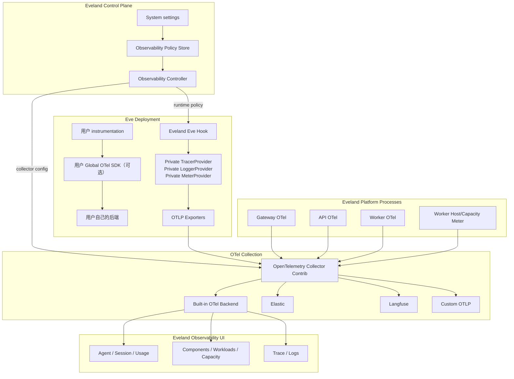

# Eveland OTel-native Observability 设计

> 日期：2026-07-23
> 状态：Historical design — Built-in 产品范围与安全出口已由 `docs/spec.md` 收窄并取代
> 设计方法：从产品需求与 OpenTelemetry 标准出发，不以当前监控实现为约束
> 工作分支：`codex/private-agent-observability`

> 2026-07-27 实现说明：本文保留早期方案与决策过程，不再是当前产品真相源。当前 Built-in
> 只投影 Sessions、Usage 与 Instance Health，不存 raw telemetry、平台统计、trace tree 或
> delivery diagnostics；外部 Destination 通过 API 安全出口转发，Collector 配置不保存远端
> URL/凭据；平台与 Agent 使用独立 receiver。与这些结论冲突的后续章节均以
> `docs/spec.md` 为准。

## 1. 设计目标

Eveland 是 Eve 的运行时平台。它需要在不改变用户 instrumentation 的前提下，统一观察：

- Agent Session、Turn、Model、Tool、Subagent 和 usage；
- Gateway/API/Worker 等平台组件；
- Deployment、Workload 和 Runtime lifecycle；
- CPU、memory、disk、inode 等宿主容量；
- Runtime stdout/stderr 和平台日志。

所有 Eveland 自有 telemetry 使用 OpenTelemetry API、semantic conventions 和 OTLP。

系统设置支持：

- 统一启停 Eveland Agent monitoring；
- 控制输入、输出和 reasoning 的采集；
- 配置 Elastic、Langfuse 和 Custom OTLP；
- 每个外部目的地独立启停、健康检查和失败隔离。

目的地能力：

| 目的地 | Traces | Logs | Metrics | 内容范围 | 管理方式 |
| --- | --- | --- | --- | --- | --- |
| Eveland Built-in | 是 | 是 | 是 | Eveland 全部 telemetry | 平台默认提供，不配置、不关闭 |
| Elastic | 是 | 是 | 是 | Eveland 全部 telemetry | System settings 可选配置 |
| Langfuse | 是 | 否 | 否 | 仅 Agent/GenAI telemetry | System settings 可选配置 |
| Custom OTLP | 可配置 | 可配置 | 可配置 | 按 capability/filter 配置 | System settings 可选配置 |

本设计不考虑当前 observer、session collector、数据库表或文件协议如何迁移。现有代码只能在
实施阶段按目标架构评估复用或删除，不能反向决定架构。

## 2. 核心产品契约

### 2.1 用户 instrumentation 完全保持原样

Eveland 不得：

- 修改、重命名或包装用户 `instrumentation.*`；
- 占用用户 instrumentation discovery slot；
- 覆盖用户 `setup`、events、sampler 或 exporter；
- 注册第二个 global Provider 与用户竞争；
- 覆盖用户的通用 `OTEL_*` 环境变量；
- 改变用户 telemetry 的目的地；
- 用 Eveland 的开关启停用户 telemetry。

用户仍可：

- 调用 `NodeSDK.start()`；
- 调用 `provider.register()`；
- 注册自己的 global TracerProvider、LoggerProvider 和 MeterProvider；
- 使用自己的 ContextManager；
- 直接发送到任何后端；
- 独立执行 shutdown。

### 2.2 Eveland 只控制自己产生的 telemetry

Eveland monitoring 开关只控制：

- Eveland 注入的 Eve Hook；
- Eveland 平台服务 instrumentation；
- Eveland Collector 中可选的外部目的地 pipeline。

Eveland Built-in 是平台默认能力：pipeline、存储、查询和 UI 始终存在，不作为 Integration
配置或启停。监控 producer 关闭后没有新数据产生，不等于关闭 Built-in。

“统一监控”表示 Eveland 自有信号统一使用 OTLP 和 Collector，不表示接管用户的 global
OTel runtime。

### 2.3 System settings 是唯一管理入口

管理员配置保存在 Eveland 数据库，不是 `.env`，也不是用户 Deployment variable：

```text
System settings
  -> revisioned Observability Policy
  -> Observability Controller
       -> Agent runtime policy
       -> Platform service policy
       -> Collector pipelines
       -> Destination credentials
```

环境变量只允许用于 Eveland 自身 bootstrap 所必需、部署拓扑固定的内部地址或 Secret
根密钥，不用于表达管理员的 enable/disable、privacy 或 destination 配置。

## 3. OTel 在本设计中的边界

OpenTelemetry负责：

- Tracer、Logger、Meter API；
- Resource、Context、Span、LogRecord、Metric 数据模型；
- W3C Trace Context；
- GenAI、HTTP、RPC、process、host 等 semantic conventions；
- OTLP/HTTP 和 OTLP/gRPC；
- Collector receiver、processor、connector、exporter；
- batch、retry、persistent queue、filter 和 transform。

Eveland只负责 OTel 不知道的 Eve 领域语义：

- Eve event 到 span/log/metric 的映射；
- Project、Release、Deployment、Session、Turn、Step 关联；
- Built-in UI 的 Session/Usage/Capacity 查询模型；
- 系统设置与权限；
- privacy policy；
- 外部目的地 capability policy。

不创建新的 telemetry transport protocol，不定义另一套 span/log/metric wire envelope。

参考：

- <https://opentelemetry.io/docs/concepts/components/>
- <https://opentelemetry.io/docs/specs/otlp/>
- <https://opentelemetry.io/docs/specs/semconv/gen-ai/>

## 4. 总体架构



## 5. Provider 所有权

### 5.1 Eve Deployment

同一个 Agent 进程允许两套独立 Provider：

```text
用户 Global Provider
Eveland Private Provider
```

Eveland private Providers：

- 从 Provider 实例直接获取 Tracer/Logger；
- 不调用 `register()`；
- 不调用 `trace.setGlobalTracerProvider()`；
- 不调用 `logs.setGlobalLoggerProvider()`；
- 不调用 `metrics.setGlobalMeterProvider()`；
- 不安装全局 ContextManager；
- 不读取 `context.active()` 构造平台父子关系；
- 不执行用户 Provider 的 flush/shutdown。

概念代码：

```ts
const traceProvider = new BasicTracerProvider({
  resource,
  spanProcessors: [new BatchSpanProcessor(traceExporter)],
});

const loggerProvider = new LoggerProvider({
  resource,
  processors: [new BatchLogRecordProcessor(logExporter)],
});

const meterProvider = new MeterProvider({
  resource,
  readers: [new PeriodicExportingMetricReader({ exporter: metricExporter })],
});

const tracer = traceProvider.getTracer("@eveland/eve-runtime");
const logger = loggerProvider.getLogger("@eveland/eve-runtime");
const meter = meterProvider.getMeter("@eveland/eve-runtime");
```

Eve 专属 instrumentation 只能通过 Eveland Hook 产生，不能依赖用户是否安装 OTel。

### 5.2 Eveland 平台进程

Gateway、API、Worker 是 Eveland 完全拥有的进程，没有用户 SDK 所有权冲突，可以各自使用
标准 global NodeSDK：

- HTTP server/client auto-instrumentation；
- fetch/undici；
- Postgres；
- runtime/process metrics；
- structured logs correlation。

Agent private Providers 与平台进程 global Providers 是两个不同的 ownership 场景，不能因为
Agent 选择 private 就禁止平台自己的进程使用 global SDK。

### 5.3 Traces、Logs、Metrics 是三个 signal

它们共享 Resource、OTLP endpoint 和 correlation identifiers，但不是一个 Provider：

```text
TracerProvider
LoggerProvider
MeterProvider
```

Collector 统一接收和路由三个 signal，不能把“统一”错误实现为一个不存在的通用 Provider。

## 6. 系统设置与运行时配置

### 6.1 Policy 模型

```text
ObservabilityPolicy
  revision
  agentCapture
    enabled
    sampling
    recordInputs
    recordOutputs
    includeReasoning
  externalDestinations[]
    kind
    enabled
    supportedSignals
    filterProfile
    encryptedConfig
    securityRevision
```

Policy 属于当前 Eveland 实例/Team。只有 Admin 可以修改。

Built-in 不属于 Policy：它是每个 Eveland 实例固定存在的默认 destination。Settings 可以展示
Built-in ingest/storage 的健康状态，但不提供配置、删除或关闭操作。

### 6.2 Agent runtime policy 交付

Hook 需要知道有效开关、privacy、平台内部 Collector 地址和 Deployment provenance，但这些
不是用户环境变量。

Observability Controller 为每个 Deployment 生成不含 Secret 的 revisioned runtime policy：

```json
{
  "schemaVersion": 1,
  "revision": 42,
  "capture": {
    "enabled": true,
    "sampleRatio": 1,
    "recordInputs": true,
    "recordOutputs": true,
    "includeReasoning": true
  },
  "otlp": {
    "endpoint": "http://127.0.0.1:4318"
  },
  "resource": {
    "teamId": "team_...",
    "projectId": "proj_...",
    "releaseId": "rel_...",
    "deploymentId": "dep_...",
    "runtimeKind": "systemd",
    "environment": "production"
  }
}
```

交付要求：

- 写入 platform-owned Deployment data directory；
- 原子更新；
- Docker/systemd 只读映射到固定 runtime path；
- Project Variables、Secrets 和 Shared Agent Environment 无法覆盖；
- Hook 按 revision/mtime 有界刷新；
- capture/privacy 普通变更不重启 Agent；
- config 缺失或无效时只关闭 Eveland telemetry，Agent 继续运行。

### 6.3 External destination 配置

External endpoint、auth、TLS 和 headers 由 API 加密保存，并只在
service-authenticated egress proxy 内解密：

- Agent 不持有 Elastic/Langfuse credential；
- Agent 不知道启用了哪些外部产品；
- external destination 开关不重启 Agent；
- 一个 external destination 失败不改变 Built-in 或其他 destination；
- Collector 只持有 Destination ID 和 API proxy 地址，不持有远端 credential；
- credentials 使用 `APP_SECRET_KEY` 加密，API 永不返回原值。

## 7. Telemetry 分类与路由标签

OTel standard attributes 优先。标准没有表达的 Eveland provenance 使用
`eveland.*`。

每个 Resource 至少包含：

```text
service.name
service.version
service.instance.id
deployment.environment.name
host.name（仅平台/宿主信号）
process.runtime.name
```

Eveland扩展：

```text
eveland.team.id
eveland.project.id
eveland.release.id
eveland.deployment.id
eveland.runtime.kind
eveland.telemetry.domain
```

`eveland.telemetry.domain` 是稳定路由维度：

| domain | 内容 |
| --- | --- |
| `agent` | Eve/GenAI Session、Turn、Model、Tool、Subagent |
| `platform` | API、Gateway、Worker、Collector |
| `runtime` | Deployment/Workload lifecycle、stdout/stderr |
| `capacity` | CPU、memory、disk、inode、load |

不能根据 span name、scope 猜测 domain。scope 用于 producer identity，domain 用于产品路由。

## 8. Agent traces

### 8.1 Trace 边界

一个 durable conversation 可以持续多天，不适合作为一个长期不结束的 span。

设计为：

```text
Conversation / Eve Session
  -> 多个 Invocation Trace（每个 Turn 或一次 Schedule invocation）
```

使用标准或稳定关联字段：

```text
gen_ai.conversation.id
session.id
eveland.eve.session.id
eveland.eve.turn.id
```

Langfuse 使用 session/conversation 标识把多个 trace 聚合为同一会话。Eveland Built-in
同样按 conversation/session ID 聚合。

### 8.2 Span tree

```text
invoke_agent (Turn)
  ├─ chat / generate_content (Model Step)
  ├─ execute_tool
  └─ invoke_agent (Subagent)
```

映射：

| Eve lifecycle | OTel |
| --- | --- |
| turn start/end/failure/cancel | Agent invocation span |
| step start/completed/failed | GenAI model span |
| tool requested/result | execute_tool span |
| subagent call/start/completed | nested invoke_agent span 或 span link |
| schedule dispatch | Worker span -> Agent invocation |
| Gateway request | HTTP server span -> Agent invocation |

### 8.3 显式 Context

Agent private Providers 不使用用户 global ContextManager。

父子关系通过 Eveland runtime bridge 显式传递：

- Gateway 创建/提取 W3C `traceparent`；
- Schedule Worker 创建 dispatch context；
- Eveland 通过可信 runtime metadata 把 `SpanContext` 交给 Eve Hook；
- Hook 创建 span 时显式传入 parent Context；
- 无法建立 parent 时使用 span link 和稳定 session/request ID。

这要求 Eve runtime 最终提供平台 observation context。若当前 Hook API 无法传入该 context，
第一阶段允许 trace link，不允许通过篡改用户 global context 强制拼接。

### 8.4 Model usage

Model span 使用 GenAI semantic conventions：

```text
gen_ai.operation.name
gen_ai.provider.name
gen_ai.request.model
gen_ai.response.model
gen_ai.usage.input_tokens
gen_ai.usage.output_tokens
```

cache read/write 和 provider cost 在标准已定义时使用标准字段，否则使用明确的
`eveland.gen_ai.*` 扩展，不能伪造标准字段。

原则：

- 只使用 Eve/provider 实际报告的 usage；
- 缺失保持缺失；
- 不查公开价目表估算 cost；
- model/provider 无法可靠识别时留空；
- cache 是否已包含在 input 中用真实 provider fixture 验证；
- Built-in、Elastic、Langfuse 各自有 token mapping contract test。

## 9. Agent logs

每个需要保留的 Eve lifecycle event 产生标准 OTel LogRecord：

```text
timestamp
observedTimestamp
severityNumber
severityText
event.name = eve.<event-type>
body = sanitized structured Eve event
traceId / spanId（存在 active platform span 时）
attributes
```

稳定 Eveland attributes：

```text
eveland.event.id
eveland.event.fingerprint
eveland.eve.session.id
eveland.eve.parent_session.id
eveland.eve.turn.id
eveland.eve.step.index
eveland.eve.agent.id
eveland.eve.agent.name
eveland.eve.channel.kind
```

用途：

- Built-in Session timeline；
- Elastic structured event search；
- trace/log correlation；
- replay/dedup。

Langfuse pipeline 不接收这些 logs。

输入、输出和 reasoning 在 Producer 创建 LogRecord 前按 policy 删除。Collector filter 不是
隐私第一道边界，因为进入 Collector 已经意味着数据离开 Agent 进程。

## 10. Metrics

### 10.1 Agent usage metrics

单次 Session/Turn/Model 详情以 spans 为事实来源。Hook 在同一个
`step.completed` observation 中通过 private MeterProvider 记录标准 GenAI metrics，
不另外维护一套业务聚合状态。Collector connector 可以从 spans 派生通用 calls/duration，
但不能取代 provider-reported token metrics。

至少提供：

```text
gen_ai.client.operation.duration
gen_ai.client.token.usage
eveland.agent.invocations
eveland.agent.failures
eveland.agent.tool.calls
```

指标维度必须限制 cardinality。Project、model、provider、status 可以作为维度；原始
session ID、turn ID、prompt 和 URL 不能成为 metric label。

### 10.2 Platform component metrics

API、Gateway、Worker 各自产生：

- request/job duration；
- error count；
- queue depth/age；
- active requests；
- deployment activation/restart；
- Collector delivery health。

优先使用标准 HTTP、RPC、DB、process semantic conventions。

### 10.3 Capacity metrics

Worker 是唯一宿主特权采集者：

- CPU；
- load；
- available/used memory；
- filesystem capacity；
- inode；
- process/workload state。

Worker 将同一采样通过 MeterProvider 发送 OTLP，同时可供 Built-in 容量预测使用。

Collector 不挂载宿主 `/`，不因为使用 `hostmetricsreceiver` 获得额外宿主权限。

## 11. Runtime logs

Runtime stdout/stderr 也进入 OTel Logs：

- Docker 使用受限日志读取边界；
- systemd 使用 journald receiver 或 Worker forwarding；
- 添加 Project/Release/Deployment Resource；
- Secret masking 在进入 Collector 前完成；
- multiline、size limit 和 rate limit 明确；
- Built-in 和 Elastic 接收；
- Langfuse 不接收。

Build/Deploy logs 可以继续作为产品日志存在，同时通过 OTel Logs 导出；不要求把它们伪装成
Agent spans。

## 12. OpenTelemetry Collector

使用 OpenTelemetry Collector Contrib，不自行实现 fan-out daemon。

### 12.1 Receiver

```text
otlp/http
otlp/grpc（平台内部可选）
```

Docker 使用私有 service network；systemd 使用 loopback。Collector 不公开到 Internet。

### 12.2 Common processors

- `memory_limiter`；
- `batch`；
- resource normalization；
- attributes allowlist/drop；
- sampling；
- redaction；
- transform/OTTL；
- per-domain routing。

### 12.3 Reliability

每个 exporter 独立配置：

- retry；
- persistent `sending_queue`；
- `file_storage`；
- queue size；
- timeout；
- health metrics。

Collector 接收之后为 at-least-once。Producer 到 Collector 使用标准 OTel best-effort
语义；terminal Agent operation 和 graceful shutdown 执行 bounded flush。

Observability 不是计费账本。若未来需要硬崩零丢和计费级 token accounting，应另建领域
账本，不把非标准 source spool 伪装成 OTel observability。

## 13. 目的地 pipeline

### 13.1 Built-in

```text
input: traces + logs + metrics
filter: Eveland-owned resources/scopes
output: Built-in OTLP Backend
queue: persistent
mode: mandatory platform pipeline
```

Collector 配置始终包含 Built-in pipeline。Admin 不创建、不编辑、不关闭它；运行异常进入
Instance Health 和 Observability UI 的 delivery diagnostics。

### 13.2 Elastic

```text
input: traces + logs + metrics
filter: all Eveland domains
output: Elastic OTLP endpoint
auth: Bearer 或 ApiKey preset
queue: independent persistent queue
```

Elastic 本质是标准 OTLP destination preset，不在 Agent 中安装 Elastic SDK。

### 13.3 Langfuse

```text
input: traces
filter:
  eveland.telemetry.domain == "agent"
  GenAI/Agent span allowlist
output: Langfuse native OTLP/HTTP traces endpoint
auth: Collector-owned
queue: independent persistent queue
```

System settings 只接收 Langfuse Base URL，例如
`https://us.cloud.langfuse.com`。Eveland 内部派生
`/api/public/otel/v1/traces`，不要求管理员配置 OTLP signal path。

Langfuse 不接收：

- platform HTTP spans；
- Worker job spans；
- capacity metrics；
- runtime logs；
- 用户 instrumentation spans。

必要的 Langfuse attributes 在 Collector transform 中添加，同时保留标准 GenAI attributes。
Collector 必须按 Langfuse v4 observation-centric OTLP contract 转换：

- `/api/public/otel/v1/traces` 使用 OTLP/HTTP；
- 添加 `x-langfuse-ingestion-version: 4`，认证只保存在 Collector；
- Langfuse 直连 OTLP v4 当前承诺的 `langfuse.observation.type` 值为
  `span | generation | event`：model call 映射为 `generation`，Agent、Tool 与 Subagent
  映射为 `span`，具体 `gen_ai.operation.name` 复制到可过滤 observation metadata；
- 将 root Agent span 的 `gen_ai.input.messages` / `gen_ai.output.messages` 映射到
  `langfuse.observation.input` / `langfuse.observation.output`；
- Tool/Subagent 的 arguments/result/input/output 映射到各自 observation；
- 每个需要聚合的 span 都携带 `session.id`、environment、release 和必要 metadata；
- model 与标准 `gen_ai.usage.*` 由 Langfuse OTLP mapping 读取，Eveland 扩展的
  provider-reported cost 在 Collector 中转换为 `langfuse.observation.cost_details`；
  不创建第二份 Langfuse 专用 trace。

参考 Langfuse 官方
[OTel attribute mapping](https://langfuse.com/integrations/native/opentelemetry#attribute-mapping)
和
[v4 custom ingestion contract](https://langfuse.com/integrations/native/opentelemetry/migration-to-v4)。

### 13.4 Custom OTLP

管理员明确选择：

- traces/logs/metrics；
- domains；
- endpoint/protocol；
- TLS；
- headers；
- sampling。

不允许 destination 自称支持某 signal 但 Collector 没有对应 pipeline。

## 14. Built-in OTel Backend

Eveland Built-in 必须在没有 Elastic、Langfuse、Grafana 或其他基础设施时可用。

OpenTelemetry 标准化 instrumentation、signals、semantic conventions 和 OTLP，但不规定统一的
存储 schema、查询 API 或前端。因此，“使用 OTel 标准”不能消除 Built-in backend；它要求
Built-in 成为一个标准 OTLP destination，而不是继续使用平台私有采集协议。Eveland 特有的
Session/Usage/Capacity read model 属于产品查询层，不属于新的 telemetry protocol。

它是一个真正的 OTLP destination，而不是读取 Agent 私有文件：

```text
Collector
  -> authenticated OTLP/HTTP
  -> Built-in ingest
  -> Postgres OTel storage/read models
  -> Eveland UI
```

### 14.1 标准入口

Built-in ingest 接受标准：

- `ExportTraceServiceRequest`；
- `ExportLogsServiceRequest`；
- `ExportMetricsServiceRequest`；
- OTLP protobuf/JSON；
- OTLP partial success response。

使用官方 OpenTelemetry proto schema/generated types，不定义自有 wire envelope。

### 14.2 存储策略

MVP 继续使用产品必需的 Postgres，不新增外部强依赖。存储分两层：

1. OTel telemetry store
   - Resource；
   - Span；
   - LogRecord；
   - Metric point；
   - retention partition/index。
2. Eveland read models
   - Agent Conversation/Session；
   - Turn/Step/Tool/Subagent；
   - Model usage；
   - Project/Deployment health；
   - Capacity time series。

OTel store 保存标准 telemetry；read model 是 Eveland UI 的查询优化，不是新协议。

### 14.3 幂等

- Span 使用 `(traceId, spanId)`；
- Metric point 使用 resource/scope/name/attributes/timestamp identity；
- Agent event log 使用 `eveland.event.id/fingerprint`；
- Model usage 使用稳定 operation/turn/step identity；
- Collector retry 不重复累计。

### 14.4 Retention

Built-in 使用 Eveland 定义的默认 retention policy，System settings 不提供 Built-in
retention 配置。默认策略分别覆盖：

- raw traces：30 天；
- raw logs：30 天；
- raw metrics：30 天；
- derived Session/Usage：90 天；
- capacity samples：30 天。

Retention 清理不影响外部 Elastic/Langfuse 已接收的数据。

## 15. Built-in UI

### 15.1 Agent

- Conversation/Session list；
- Turn timeline；
- Model spans；
- Tool/Subagent tree；
- token/cache/cost；
- trace/log correlation；
- missing telemetry coverage。

### 15.2 Usage

- Session/Invocation/Model step；
- input/output/cache tokens；
- provider-reported cost；
- Project、Agent、Model、Provider attribution；
- 24h/7d/30d；
- coverage 与 cost coverage。

### 15.3 Platform

- API/Gateway/Worker/Collector health；
- request/job latency and errors；
- queue/workload；
- Deployment lifecycle；
- Collector destination delivery。

### 15.4 Capacity

- CPU/load；
- memory；
- disk/inode；
- trend/forecast；
- Runtime workload distribution。

前端只查询 Built-in backend/read models，不直接查询 Agent，也不要求安装外部 UI。

## 16. 开关语义

### 16.1 Agent capture

Admin 在 System settings 中关闭后：

- Policy revision 更新；
- 运行中的 Hook 动态读取新 revision；
- 停止产生新的 Eveland Agent spans/logs；
- bounded flush 已有 batch；
- 用户 instrumentation 继续运行；
- 平台组件和容量 telemetry 可继续运行。

重新开启只恢复 Eveland private Providers。

Built-in 始终接收所有仍然启用的 Eveland producers。它没有 enable/disable 开关；不可用时
显示为平台故障，而不是配置状态。

### 16.2 External destination

Elastic/Langfuse/Custom OTLP 的 enable/disable：

- 只改变对应 Collector pipeline；
- 不重启 Agent；
- 不改变 capture policy；
- 不影响其他 destination。

## 17. 安全与隐私

- External credentials 只存在于加密配置和 API egress proxy 的单次请求内；
- Agent 只访问无凭据的私有 OTLP endpoint；
- Collector 没有 Docker socket、Project source、Secret store 或 host root mount；
- 用户输入/输出/reasoning 在 Agent producer 处裁剪；
- Runtime logs 在进入 Collector 前 masking；
- Authorization、Cookie、Secret 和 affinity material 不进入 telemetry；
- OTLP receiver 不公开；
- Built-in ingest 使用 service authentication；
- external egress proxy 验证每个 Agent Resource 的 Deployment credential，
  覆盖 Agent 自报归属，并在远端发送前删除 credential；
- external endpoint 执行 SSRF、TLS、DNS rebinding 和 reserved-header 校验；
- telemetry 故障不得使 Agent turn、Gateway 请求或 Worker job 失败。

## 18. 使用的成熟组件

Agent/platform JavaScript：

- `@opentelemetry/api`；
- `@opentelemetry/resources`；
- `@opentelemetry/sdk-node`；
- `@opentelemetry/sdk-trace-base`；
- `@opentelemetry/sdk-logs`；
- `@opentelemetry/sdk-metrics`；
- OTLP HTTP/gRPC exporters；
- OTel JS Contrib instrumentations。

Collection：

- OpenTelemetry Collector Contrib；
- OTTL filter/transform；
- batch/memory limiter；
- file storage persistent queues；
- connectors such as span metrics where semantics match。

Built-in ingest：

- official `opentelemetry-proto` definitions/generated types；
- standard OTLP requests/responses。

不使用：

- `@vercel/otel`，因为它包含 Vercel-specific runtime和 global Provider ownership；
- Elastic/Langfuse SDK in Agent；
- 自定义 telemetry envelope/HTTP protocol；
- 第二个 global Provider。

## 19. 实施顺序

### Phase 1 — Contract and proof

1. 定义 Observability Policy、runtime policy 和 capability contracts。
2. 建立 OTel semantic mapping fixtures。
3. 证明 Eve Hook private Providers 与用户 global Providers 并存。
4. 证明用户 instrumentation 文件和 runtime behavior 不变。
5. 证明 OTLP Collector 可同时发送 Built-in、Elastic test sink、Langfuse test sink。

### Phase 2 — Agent producer

1. Eve Hook instrumentation；
2. private Trace/Logger providers；
3. turn/model/tool/subagent spans；
4. Eve event logs；
5. privacy、sampling、flush、fail-open；
6. runtime policy dynamic reload；
7. Eve supported-version compatibility matrix。

### Phase 3 — Platform producers

1. API/Gateway/Worker NodeSDK；
2. HTTP/DB/job traces；
3. structured logs；
4. component/process metrics；
5. Worker capacity metrics；
6. runtime log collection。

### Phase 4 — Collector

1. private receivers；
2. common processors；
3. domain routing；
4. persistent per-destination queues；
5. health/self metrics；
6. Docker/systemd topology；
7. validate/apply/rollback controller。

### Phase 5 — Built-in backend

1. standard OTLP ingest；
2. Postgres OTel store；
3. Agent read models；
4. platform/capacity read models；
5. retention；
6. replay/dedup/partial success。

### Phase 6 — Settings and integrations

1. Admin Agent capture/privacy settings；
2. Built-in health 的只读展示；
3. encrypted external destination config；
4. Elastic full-signal preset；
5. Langfuse Agent-trace preset；
6. Custom OTLP capability config；
7. external destination health/probe。

### Phase 7 — UI

1. Agent trace/Session；
2. Usage；
3. Platform components/workloads；
4. Capacity；
5. Logs；
6. coverage/delivery diagnostics。

现有监控代码在各 Phase 中按目标契约逐个评估。没有上线迁移要求，因此：

- 不做双写；
- 不做 legacy protocol；
- 不保留只为旧实现存在的 compatibility shim；
- 可以直接删除不符合目标架构的 package、table、route 和配置。

## 20. 验收标准

### 用户 instrumentation

- source 和 prepared Release 中逐字不变；
- authored setup 正常执行；
- 用户 Provider/exporter 正常发送；
- 用户 `OTEL_*` 不被覆盖；
- Eveland开关不影响用户 telemetry；
- 无 duplicate global Provider warning。

### 标准协议

- Agent、platform、capacity 都通过 OTLP；
- Collector 可替换 destination；
- Built-in 接受标准 OTLP requests；
- 没有自定义 telemetry wire envelope；
- GenAI/HTTP/process/host semantic conventions 有契约测试。

### 路由

- Built-in 默认且始终收全部已启用的 Eveland signals；
- Settings 不存在 Built-in create/configure/disable 操作；
- Elastic 收全部 Eveland signals；
- Langfuse 只收 Agent traces；
- Custom OTLP 严格按 configured capabilities；
- 一个目的地失败不阻塞其他目的地。

### 功能

- Eve Session/Turn/Model/Tool/Subagent 可展示；
- token/model/provider/cost 可归因；
- direct Agent、Gateway、Playground、cron 都可观察；
- API/Gateway/Worker/Collector 可观察；
- CPU/memory/disk/components/workloads 可展示；
- trace/log correlation 生效。

### 可靠性与安全

- graceful stop bounded flush；
- Collector persistent queue 在 destination 恢复后重放；
- replay 不重复累计 usage；
- telemetry 故障不影响 Agent；
- Agent 不持有 external credentials；
- Secret/Authorization 不进入 telemetry；
- Collector 不获得额外宿主特权。
