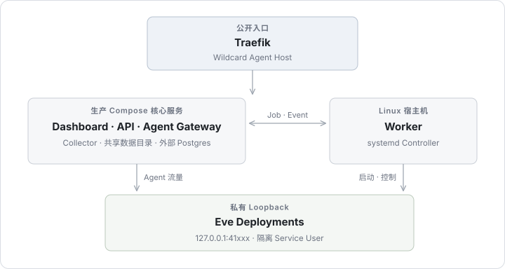

## 1. 组件所有权与职责

| 组件                    | 运行形态                   | 核心职责                                                             |
| :---------------------- | :------------------------- | :------------------------------------------------------------------- |
| **Dashboard**           | 宿主机进程 (非特权)        | 经过认证的团队管理控制台与在线调试交互界面。                         |
| **API**                 | 宿主机进程 (非特权)        | 控制面契约、元数据持久化、团队鉴权、源码导入管道与内置 OTLP 投影。   |
| **Agent Gateway**       | 宿主机进程 (`DynamicUser`) | 公网 Agent 数据面入口，负责可信路由、会话亲和性保持与流式转发。      |
| **Worker**              | 宿主机服务 (`root`)        | 负责沙箱构建、systemd 瞬态实例编排、定时调度与孤儿进程回收。         |
| **Workflow Dispatcher** | 宿主机服务 (`DynamicUser`) | 单例外置调度器，负责持久化工作流定时器触发、按需唤醒与断点任务投递。 |
| **OTel Collector**      | 容器                       | 接收平台与 Agent 的 OTLP 遥测数据，支持失败重试与多目标分发。        |
| **PostgreSQL**          | 容器或外部集群             | 承载控制面元数据与全平台共享工作流数据库（按租户逻辑隔离）。         |

---

## 2. 代码包依赖单向约束 (Dependency Direction)

Eveland 内部各模块严格遵守单向依赖规范，由架构测试固化：

```text
apps (Web, API, Gateway, Worker) ──> packages
packages/session-collector ─────────> packages/core + packages/db
packages/db ────────────────────────> packages/core
packages/core ──────────────────────> 无内部包依赖 (根模块)
apps -X-> apps (严禁应用间直接交叉引用)
```

---

## 3. 公网请求流动路径 (Request Path)

```text
外部客户端请求
  → 泛域名 HTTPS Host (*.agents.example.com)
  → 反向代理 (Traefik 终止 TLS)
  → Agent Gateway (回环端口 17300，验证 Host 与鉴权)
  → 路由决策 (根据 Route Policy 或已绑定的 SessionBinding)
  → 私有部署实例 (127.0.0.1:18000–18999)
  → Eve HTTP 通道执行
```

---

## 4. 可观测性遥测流动路径 (Observation Path)

```text
Agent 执行 / 平台组件日志
  → 注入私有 OTel Provider (不修改用户自身业务探针)
  → OTLP 协议推送至托管 Collector
  → 内置投影服务 (Built-in Ingest) 解析并存入 PostgreSQL (会话树、用量、实例健康)
  → (可选) 异步分发至外部存储 (如 Elastic、Langfuse 等)
```

- **数据保留周期**：容量与负载采样保留 30 天，解析后的会话（Session）与用量（Usage）数据保留 90 天。

## 相关参考

- [生产架构概览](/zh/docs/production)：核心服务拓扑与组件部署指南
- [设计决策总览](/zh/docs/reference/design)：平台结构性选型背后的技术权衡全集
- [为什么是 systemd 而不是 Docker](/zh/docs/reference/design/runtime)：运行时选型与资源密度论证
- [网关数据面设计](/zh/docs/reference/design/gateway)：网关数据面规则与安全隔离边界
