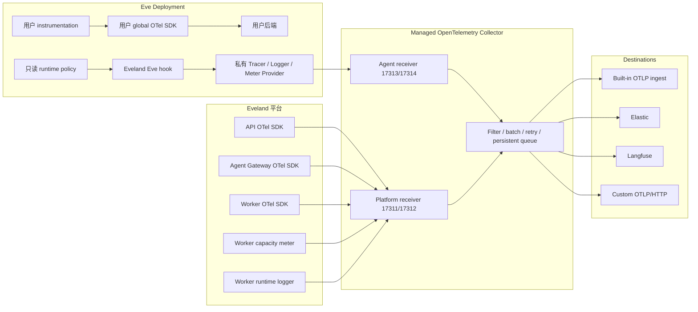

本文描述 Eveland 当前实现的监控架构，是可观测性域的权威行为契约。产品边界与架构
原则以产品规格（仓库根 `spec.md`）为准，部署参数以[生产部署](/zh/docs/production)与
[环境变量](/zh/docs/reference/environment-variables)为准。

## 产品边界

Eveland 自有遥测统一使用 OpenTelemetry API、semantic conventions 和
OTLP。Eveland 负责 Eve 领域语义、平台 Resource、采集策略、目的地路由和
Built-in 读模型，不定义私有遥测协议。

用户源码中的 instrumentation 属于用户：

- Eveland 不修改用户 instrumentation 文件、setup、sampler 或 exporter。
- Eveland 不注册或替换用户的 global `TracerProvider`、`LoggerProvider`、
  `MeterProvider` 或 `ContextManager`。
- Eveland 不覆盖用户的通用 `OTEL_*` 环境变量。
- 用户 provider 继续向用户配置的后端发送；Eveland 不读取、合并或转发这些数据。
- System settings 中的开关只控制 Eveland 注入的私有 provider。

Eveland 自有遥测分为四个稳定 domain：

| Domain     | Producer                              | 内容                                                      |
| ---------- | ------------------------------------- | --------------------------------------------------------- |
| `agent`    | 注入 Eve hook 的私有 provider         | Session、Turn、Model、Tool、Subagent、provider usage      |
| `platform` | API、Agent Gateway、Worker、Collector | HTTP、DB、job、组件和进程信号                             |
| `runtime`  | Worker 私有 logger                    | build、deploy、runtime lifecycle 日志                     |
| `capacity` | Worker 私有 meter                     | CPU、memory、load、filesystem、inode、workload、heartbeat |

## 最终数据流



Managed Collector 是唯一 fan-out 组件。Agent、API、Agent Gateway 和 Worker
只向平台管理的 receiver 发送，不持有外部产品凭据，也不知道启用了哪些外部目的地。

## Provider 所有权

### Agent

每个 Agent 进程可以同时存在两套互不接管的 provider：

```text
用户 global providers
Eveland private providers
```

`packages/agent-observer` 在 Eve 的平台保留 hook slot 注入
`@eveland/eve-runtime` instrumentation scope。私有 provider 直接通过实例获取
tracer、logger 和 meter，不调用 global registration，也不对用户 provider 执行
flush 或 shutdown。

依赖安装后的 Extension integration 还会读取 Eve v13 的 `resolvedExtensions`，对有效的
directory-form Extension Subagent（含嵌套后代与 consumer override）注入同一 observer。
部署时优先使用挂载的 `/run/eveland/observability/runtime.mjs`；烘焙进 Extension 的
fallback runtime 只在平台 mount 缺席时才求值，避免同时安装两份 model capture。Eve 的
file-form Subagent 没有独立 hooks slot，无论本地还是 Extension 来源都记录明确
coverage gap，不 patch Eve compiled internals；Extension 缺口的完整
`{kind,path,reason}` 写入 `.eveland/observability/extension-coverage-gaps.json`。

私有 provider 分别产生 traces、logs 和 metrics。三个 signal 共享 Resource 和
correlation identifiers，但由三个独立 provider 管理。

### 平台组件

API、Agent Gateway 和 Worker 是 Eveland 完全拥有的进程，由
`packages/platform-observability` 启动标准 NodeSDK。Worker 另外使用私有
LoggerProvider 和 MeterProvider 标记 `runtime` 与 `capacity` domain，避免把不同
信号来源混为一个 Resource。

API 和 Agent Gateway 都是纯 ESM HTTP 服务。它们的启动命令必须在应用入口之前预加载
`@evelandhq/platform-observability/register`，注册 OpenTelemetry ESM module hook；
否则 Node 会先完成 `node:http` 等静态依赖的模块链接，HTTP instrumentation 无法
生成 server span 和 `http.server.request.duration`。启动器在支持的 Node 版本上
使用同步的 `module.registerHooks()` 路径，并为较早的 Node 24 小版本保留异步 hook
回退。

initial Eve Session response 为带 `errorId` 的 JSON 500 时，Agent Gateway 发出
`eveland.gateway.session_create_failed`。属性把客户端可见的 Eve error id 与平台
request、Project、Deployment、已激活 RuntimeInstance、upstream status 以及（若存在）
HMAC operation key 关联；原始 operation id 永不导出。错误读取只使用有界 response
clone，不改写 Agent 的 status 或 response bytes。Workflow Dispatcher 的 registration
heartbeat 同时发出 `workflow_dispatcher.capacity`，并为每个达到 in-flight 上限的
Project 发出 `workflow_dispatcher.tenant_saturated`，从而可把同一故障窗口与全局、
租户并发饱和对齐。任一遥测发出失败都必须与 request 和 dispatch 行为隔离。

## Agent runtime policy

Admin 配置保存在 Postgres 的 revisioned observability policy 中。Worker 为每个
Deployment 生成只读 runtime policy，并挂载到：

```text
/run/eveland/observability/agent-policy.json
```

Policy 包含：

- capture enabled；
- root span sampling ratio；
- input、output content 开关（reasoning 属于 output）；
- 私有 Agent OTLP endpoint；
- Worker 签发的 Deployment credential；
- Store 已知的 Team、Project、Release、Deployment、runtime 和 environment identity。

默认启用 Agent capture，sampling ratio 为 `1`，input 和 output 采集均为开启。
运行中的 hook 按 revision 有界刷新设置，普通策略变更不重启
Deployment。Policy 缺失、无效、flush 超时或 exporter 失败时，Eveland 遥测降级，
Agent turn 继续执行。

## Collector 信任边界

Collector 使用两个 receiver：

| Receiver | 端口                        | 调用方                     | 信任方式                           |
| -------- | --------------------------- | -------------------------- | ---------------------------------- |
| Platform | gRPC `17311` / HTTP `17312` | API、Agent Gateway、Worker | `EVELAND_OTLP_SERVICE_TOKEN`       |
| Agent    | gRPC `17313` / HTTP `17314` | Eve Deployments            | 私有网络与每 Deployment credential |

Receiver 不公开到 Internet。

systemd Agent 通过宿主 loopback 访问 Agent receiver。每个活跃 Docker
Deployment 使用一个只连接该 Agent 与 Collector 的独立受管 network；Deployment
之间不共享 telemetry network。Collector 重建后，Worker 将新容器重新连接到仍有
Agent 的 network；orphan sweep 回收失去对应 Agent 的 network。

Agent receiver 强制覆盖：

```text
service.name = eveland-agent
eveland.telemetry.domain = agent
```

它只接受 `@eveland/eve-runtime` scope。该限制阻止 Agent receiver 伪装
platform、runtime 或 capacity 信号，但 authored code 与注入 hook 位于同一进程，
scope 不是同进程内的密码学 provenance。

Agent receiver 本身不认证调用方。每个 Deployment 的 policy 都包含 Worker 使用
`APP_SECRET_KEY` 派生密钥签发的 credential，私有 provider 将其放入 traces、logs
和 metrics 的 Resource。Built-in ingest 和 external egress proxy 验签后，从 Store
解析真实 Deployment，并覆盖 Agent 自报的 Team、Project、Release、Deployment 与
runtime identity。无效或缺失 credential 的 Agent Resource 不投影、不外发；proxy
在发送到外部产品前删除 credential。

Docker 只向容器挂载自己的 policy。systemd 为每个 Deployment 使用独立
`DynamicUser`，隐藏其他 uid 的 `/proc`，遮蔽共享 data root，只暴露该 Deployment
需要的 release、sandbox、policy 和 environment 路径。因此一个 Deployment 不能读取
另一个 Deployment 的 credential。

Deployment credential 不设过期；轮换 `APP_SECRET_KEY` 会作废全部 Deployment
credential，必须用新 key 重新部署所有 Agent Deployment 采集才恢复——这是受支持的
运维流程。

这个边界可以防止 Agent 把数据归到其他 Deployment，但不能阻止 Agent 为自己的
Deployment 构造虚假遥测。

## Built-in

Built-in 是固定平台能力：

- 默认存在且始终启用；
- 不属于 external destination 配置；
- 没有创建、编辑、删除或关闭入口；
- 不在 Observability 页面展示 raw spans、LogRecords、Metric Points 或接收统计。

Managed Collector 只向 Built-in 发送：

| Signal  | 来源              | Built-in 结果                                           |
| ------- | ----------------- | ------------------------------------------------------- |
| Logs    | `agent`           | Sessions、Session nodes/events、provider-reported Usage |
| Metrics | Worker `capacity` | Worker heartbeat、host capacity、Instance Health        |
| Traces  | 不发送            | 没有 Built-in trace read model                          |

Built-in 不保存 raw spans、raw LogRecords、raw Metric Points、trace tree、平台统计或
Collector delivery diagnostics。Session 详情展示投影后的 root/child node、事件和
usage；span 级下钻由接收 Agent traces 的外部产品提供。

API 的 service-authenticated OTLP/HTTP endpoint 对 traces、logs、metrics 均接受
`application/json` 和 `application/x-protobuf`，并返回对应的标准 OTLP response。
每个 item 是否接受由当前读模型投影规则决定；无效 item 通过标准
`partial_success` rejected count 报告，其余 item 继续处理。Batch receipt 只保存
signal、payload hash 和接收时间，用于重投幂等与 Collector 在线证据，不保存 payload。

投递至少一次且可乱序，因此投影必须按事件顺序而非到达顺序推进：晚到的、序号更旧的
事件仍要完整入库，但不得回退 SessionNode/Session 的状态投影，也不得改写
last-observed Deployment/RuntimeInstance provenance。判据是 Eve 自带的 per-session
`data.sequence`；事件缺少该序号时无从排序，投影退化为 last-writer-wins。终态不是
"粘住"的——continuation 唤醒会话时 completed → running 是合法转换，必须依据序号而非
状态本身来判断。Worker 心跳与 host metric 同理：重放的旧批次不得让 `observedAt`
倒退，否则健康的 worker 会被显示为失联。

Retention 是固定平台默认值：

| 数据                        | Retention |
| --------------------------- | --------- |
| Capacity samples            | 30 天     |
| Session / Usage read models | 90 天     |
| OTLP batch receipts         | 24 小时   |

运行中的 Session 不参与清理。外部产品已经接收的数据不受 Built-in retention 影响。

## 外部 destinations

只有 Admin 可以在 **Settings → Observability** 管理外部目的地和 Agent capture
策略。页面不承担监控数据展示。

| Destination      | Signals               | Domains              | 行为                  |
| ---------------- | --------------------- | -------------------- | --------------------- |
| Elastic          | traces、logs、metrics | 全部 Eveland domains | 完整平台与 Agent 遥测 |
| Langfuse         | traces                | `agent`              | Agent/GenAI trace     |
| Custom OTLP/HTTP | Admin 选择            | Admin 选择           | 按配置过滤            |

Langfuse 设置只要求 installation base URL，例如
`https://us.cloud.langfuse.com`。Eveland 派生
`/api/public/otel/v1/traces`，model call 映射为 generation，Agent、Tool 和
Subagent 保持 span，并保留标准 GenAI model、usage 和 provider-reported cost。

外部目的地配置保存在 revisioned policy 中，凭据使用 `APP_SECRET_KEY` 加密。
浏览器只能再次读取 URL、authorization 类型和 header 名称，不能读回凭据值。编辑时
留空凭据表示保留已保存值；首次创建必须提供。
Destination 的产品类型创建后不可更改；页面展示 Admin 配置的远端 URL，不展示派生
signal endpoint。无法用当前 `APP_SECRET_KEY` 解开的 Destination 仍要列出并可编辑
替换，不能静默隐藏。

Collector 的动态配置只包含 Destination ID 和 service-authenticated API proxy
endpoint，不包含远端 URL 或凭据。API egress proxy 在每次发送时：

1. 读取并解密当前 destination；
2. 再次执行 signal/domain policy；
3. 验证 Agent Deployment credential 并覆盖归属；
4. 删除内部 credential；
5. 执行 SSRF、DNS 和 header 检查；
6. 固定到已验证地址并发送，不跟随 redirect。

默认只允许 HTTPS 且所有 DNS 结果都必须是公网地址。loopback、private、
link-local、metadata 和其他非公网地址被拒绝。私有 OTLP 只能通过运维配置的精确
hostname/IP allowlist 放行，不支持通配符。

每个 external exporter 有独立 retry 和 file-backed persistent sending queue。
一个目的地失败不阻塞 Built-in 或其他目的地。Worker 每五分钟发送不含业务数据的
空 OTLP 请求进行健康探测，Settings 展示 `pending`、`healthy`、`degraded` 或
`paused`。Collector self-metrics 只路由到接收 metrics 与 `platform` domain 的外部
目的地。

平台自身遥测的观测完全由外部目的地承担：未启用 Elastic 或 Custom OTLP 时，
`platform`/`runtime` domain 的 trace 与 log 不在任何地方留存；Langfuse 只承接
Agent traces，不能作为平台自身遥测的目标；Eveland 也不为 Collector 的投递量与
queue 压力建立本地视图。

## 可靠性和隐私

- 遥测失败不得使 Agent turn、Agent Gateway request 或 Worker control loop 失败。
- Agent operation 结束、policy revision 切换和 shutdown 使用最多两秒的 bounded
  flush/shutdown。
- Collector 接收后的 delivery 是 at-least-once；Built-in projection 和 usage
  aggregation 必须幂等。创建也包括在内：同一个 Eve session 最初几条事件所在的 batch
  经常重叠，竞争创建其 SessionNode 的输家会重新读取赢家的行，而不是失败。
- Collector 的 OTLP/HTTP exporter 只重试 429/502/503/504，其他状态码（包括 500）一律
  视为永久失败——batch 离开持久化队列，数据丢失。因此 Built-in 对格式正确的 batch
  在 projection 阶段失败时回答 503 而非 500：projection 幂等，重放是安全的；持续失败
  会表现为 Collector 队列积压，而不是静默丢失。只有畸形请求和 `partial_success`
  中的逐项拒绝才是最终结果。
- input 和 output（含 reasoning）在 Agent producer 处按 policy 裁剪。
- Model call 的 input 是 Eveland 从 Eve event stream 重建的会话，不是模型收到的
  prompt：不含 system prompt、resolved instructions 和 tool schema，只覆盖当前
  turn。`eveland.gen_ai.input.reconstructed` 和 `eveland.gen_ai.input.elided`
  标注重建与裁剪；compaction 之后被折叠掉的历史用 GenAI semantic conventions 的
  `compaction` message part 就地表示，不使用私有属性。
- Message 内容遵循 GenAI semantic conventions 的 `gen_ai.input.messages` /
  `gen_ai.output.messages` JSON schema（`role` + `parts`，output 带
  `finish_reason`），part 类型只用 `text`、`reasoning`、`tool_call`、
  `tool_call_response` 和 `compaction`。Eveland 不为某个 destination 的渲染器改写
  这个 payload；目的地专属形状属于该目的地的 exporter 配置。
- Secret、Authorization、Cookie、affinity material 和 destination credential
  不进入遥测。
- Runtime log 在导出前使用既有 diagnostic masking。
- Collector 没有 Docker socket、source、release、deployment environment、
  sandbox、Secret store 或 host root mount。
- Collector 缺失只使 telemetry 降级，不阻止 Agent 启动、重启或 cold activation。
- Observability 不是计费账本；usage 只采用 Eve/provider 实际报告的值，缺失保持缺失。

## 故障排查

### Instance Health 显示 Collector 离线

Instance Health 的 Collector 状态来自最近一次 OTLP 批次的到达时间——Collector 是
Built-in 的唯一发送方，过期的批次不再证明它在线。先检查
`EVELAND_OTEL_COLLECTOR_CONTAINER`（默认 `eveland-otel-collector`）容器本身。
Worker 把 revisioned 设置渲染到 `<EVELAND_DATA_DIR>/otel/collector.yaml`，先用钉住的
`EVELAND_OTEL_COLLECTOR_IMAGE` 镜像校验候选配置，通过后才原子替换并只重启
Collector；重启失败会回滚到上一份配置并再次重启，因此被拒绝的设置变更不会替换掉
最后一份有效配置。Collector 缺失只使遥测降级：Agent 启动、重启与 cold activation
不受影响，Collector delayed/degraded 也不等价于 Agent Traffic 已中断。

### 外部 Destination 长期 degraded

Worker 每五分钟通过同一条 API egress proxy 路径，用不含业务数据的空 OTLP 请求独立
探测每个外部 Destination；Settings 展示 `pending`、`healthy`、`degraded` 或
`paused`。持续 `degraded` 时依次检查：远端 URL 与凭据（编辑时留空凭据表示保留已
保存值）；SSRF 策略——默认只允许 HTTPS 且所有 DNS 结果都必须是公网地址，HTTP 或
私网目的地必须进入 API 与 Worker 都配置的
`EVELAND_OBSERVABILITY_PRIVATE_ENDPOINT_ALLOWLIST` 精确 allowlist。每个 exporter
的 retry 与持久化 sending queue 相互独立，单个 Destination 故障不阻塞 Built-in 或
其他 Destination，不要把它当作 Built-in 故障处理。

## 实现位置

| 位置                                           | 职责                                                                                 |
| ---------------------------------------------- | ------------------------------------------------------------------------------------ |
| `packages/agent-observer`                      | Eve hook 注入、私有 providers、event/GenAI 映射、动态 policy                         |
| `packages/platform-observability`              | API、Agent Gateway、Worker OTel SDK 与 capacity/runtime providers                    |
| `packages/session-collector`                   | 标准 OTLP JSON/protobuf 解码和 Built-in 投影                                         |
| `packages/core/src/observability`              | policy、destination、runtime 和 signal contracts                                     |
| `packages/db`                                  | policy、destination health、batch receipt、Session/Usage/Instance Health persistence |
| `apps/api/src/app-otel-routes.ts`              | service-authenticated Built-in OTLP ingest                                           |
| `apps/api/src/observability`                   | policy service 与安全 egress                                                         |
| `apps/worker/src/jobs/collector-observability` | Collector 配置生成、验证、应用和健康协调                                             |
| `apps/web/src/app/settings/observability`      | external destinations 与 Agent capture 设置                                          |
| `infra/otel/collector.yaml`                    | 默认 managed Collector 配置                                                          |

## 深入参考

- [可观测性设计决策](/zh/docs/reference/design/observability)：为什么选择 OpenTelemetry 作为唯一遥测传输
- [会话与用量追踪](/zh/docs/observe/sessions)：面向开发者的 Session 与 Usage 模型概览
- [健康与诊断](/zh/docs/operations/diagnostics)：Collector 存活检查与故障定位
- [架构参考](/zh/docs/reference/architecture)：系统 Observation Path 与信号流向图
